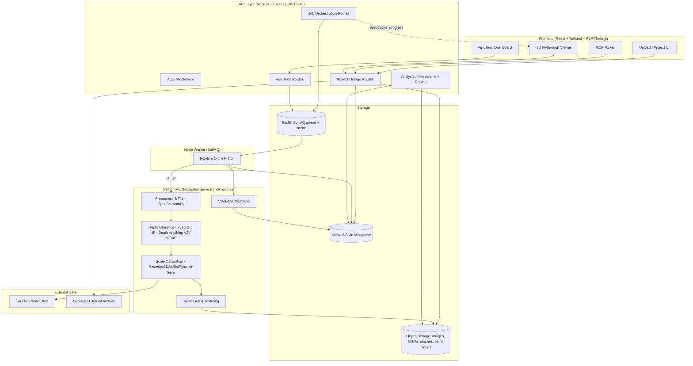

# DepthWizard — Feature List & System Design

Reference document for building DepthWizard (single-view height estimation + 3D flythrough).
Intended to be used as shared context for UI generation (Stitch) and coding agents.

---

## 1. Tech Stack

Updated to match the confirmed stack:

| Layer | Choice | Why / Notes |
|---|---|---|
| Frontend | React.js + Tailwind CSS + Three.js + React Three Fiber | R3F gives you a declarative React wrapper around Three.js — much easier to manage viewer state (selected layers, measurement mode, LOD) as React state instead of imperative Three.js calls |
| Backend API | Node.js + Express.js + REST APIs | User-facing CRUD, auth, and orchestration layer |
| Auth | JWT | Stateless tokens issued on login, verified via Express middleware on protected routes |
| Database | MongoDB + Mongoose | Document model fits the pipeline well — images, GCPs, and DSM results are naturally nested/variable-shape objects rather than rigid rows. MongoDB's native GeoJSON + `2dsphere` indexes cover bounds/points; heavier raster work stays in the Python service, not the DB |
| ML / Geospatial service | Python: PyTorch, Hugging Face Transformers, Depth Anything V2 / MiDaS, OpenCV, NumPy, Rasterio, GDAL, SciPy / scikit-learn | This is a **separate service from the Express API**, since Node has no first-class equivalent for GDAL/Rasterio/PyTorch. Express calls into it over internal HTTP (or a queue — see below) |
| Object storage | S3-compatible (S3/GCS/MinIO) | Raw images, GeoTIFFs, glTF meshes, point clouds — large binary blobs don't belong in MongoDB documents (use `storage_path` references, not embedded blobs) |
| Job queue | BullMQ + Redis (Node-native) | Depth inference, calibration, and mesh generation are slow — need async workers, not request/response. Express enqueues jobs; a Node worker process consumes them and makes synchronous calls into the Python service per pipeline stage (keeps the queue itself single-language, avoids needing a Python BullMQ-compatible client) |

**Why the Node↔Python split matters for the coding agent:** this is a two-service backend, not one. The Express API/worker owns orchestration, auth, MongoDB writes, and job state. The Python service is a stateless inference/processing server (e.g. FastAPI or Flask internally is fine — it's never exposed to the frontend) that exposes endpoints like `/infer-depth`, `/calibrate`, `/generate-mesh`, `/compute-validation`, and returns results (or writes directly to S3 and returns a path). Keep this boundary explicit when scaffolding the repo — e.g. `apps/api` (Node) and `apps/ml-service` (Python) as separate deployable units.

---

## 2. Novel Feature Ideas

The brief's baseline is: upload image → relative or absolute DSM → 3D flythrough. Below are features that go beyond that baseline, grouped by where they add the most differentiation.

### 2.1 Pipeline & Model Layer

**Multi-backbone model selection + ensembling**
Let the user (or an auto-selector based on image characteristics) choose between depth backbones — e.g. Depth Anything V2, ZoeDepth, DPT-Large, Metric3D — or run several and blend outputs. Different backbones perform differently on urban vs. forested vs. hilly terrain, and exposing this turns a black-box pipeline into something a GIS analyst can tune.

**Per-pixel uncertainty / confidence maps**
Alongside the DSM, output a confidence heatmap (from ensemble disagreement or model-native uncertainty). Overlay it in the 3D viewer as a toggleable layer. This matters a lot for disaster-response and military use cases where "how much do I trust this elevation" is as important as the elevation itself.

**Semantic-aware scale calibration**
Run a lightweight land-cover/building segmentation pass and use class-specific height priors (e.g., typical building story height, road = ~0 elevation, tree canopy offsets) to constrain the relative→absolute mapping, especially useful when SRTM resolution is too coarse or GCPs are sparse.

**Interactive GCP calibration tool**
A UI where the user clicks points directly on the uploaded image and enters known elevations (or picks them off an embedded basemap). Feeds directly into the calibration module as an alternative/supplement to SRTM. This is the single highest-leverage feature for improving absolute-DSM accuracy on user-supplied imagery.

**Tiled processing for large scenes**
Auto-tile large satellite images, run inference per-tile in parallel workers, and stitch DSMs back together with seam-blending. Needed for anything above a few thousand pixels per side — most GPUs can't run a monocular depth model on a full satellite scene in one pass.

### 2.2 Analysis Tools (in the 3D viewer)

**Measurement suite** — click two points to get straight-line distance, elevation difference, and slope angle; click a building footprint to get estimated height and volume.

**Viewshed / line-of-sight analysis** — pick an observer point, render what's visible vs. occluded across the terrain. Directly relevant to the brief's "military reconnaissance" use case.

**Flood / inundation simulation** — given the DSM, let the user set a water elevation and visualize the flooded extent in the 3D scene. Strong fit for the "disaster management" use case in the brief.

**Temporal change detection** — upload two images of the same area at different times, align them, and diff the resulting DSMs to highlight new construction, collapsed structures, or terrain change. Export as a heatmap overlay.

### 2.3 Validation & Trust

**One-click validation dashboard** — user uploads a reference LiDAR/DEM tile, system auto-aligns it to the estimated DSM and computes RMSE/MAE/correlation, broken down by terrain type (urban/sparse/hilly/forested) if a land-cover mask is available. Generates a shareable report — this maps directly onto the brief's 50%-weighted evaluation criterion, so making it self-serve is a strong differentiator.

**Model feedback loop** — let users manually correct obviously-wrong height regions in the viewer; log corrections as training signal for future fine-tuning of the calibration module.

### 2.4 Visualization & UX

**Multi-format export** — GeoTIFF (DSM), OBJ/glTF (mesh), LAS/LAZ (point cloud), MP4 (recorded flythrough) — so output plugs into existing GIS/CAD/video workflows instead of being locked in the viewer.

**LOD streaming for large meshes** — progressive mesh loading (coarse-to-fine) so a flythrough over a large tiled scene doesn't require downloading the full-resolution mesh up front.

**Collaborative annotations** — multiple users can drop pins/notes in the 3D scene (e.g., "height estimate looks off here"), useful for team review workflows.

**Public imagery ingestion** — pull imagery directly from Sentinel-2/Landsat public archives by drawing a bounding box, instead of requiring a manual upload, for georeferenced-mode demos.

### 2.5 Stretch

- Mobile AR viewer for walking through the reconstructed terrain on-site.
- Relighting the mesh using estimated surface normals (time-of-day slider) for better visual inspection of shadows/slopes.

---

## 3. System Architecture



### Component responsibilities

- **Express API** — stateless, horizontally scalable. Handles auth (JWT), CRUD via Mongoose, signed URL issuance for direct-to-S3 uploads, and job enqueueing onto BullMQ. Never runs inference itself.
- **Node Worker (BullMQ consumer)** — owns pipeline orchestration: pulls a queued job, calls the Python ML service's stages in sequence over internal HTTP, updates job status/progress in MongoDB after each stage, pushes progress over WebSocket.
- **Python ML Service** — internal-only, never exposed to the frontend. Exposes stateless endpoints per stage:
  - `POST /infer-depth` — loads the requested backbone (Depth Anything V2 / MiDaS via Hugging Face Transformers + PyTorch), returns a relative depth map.
  - `POST /calibrate` — takes relative depth + SRTM tile or GCPs, uses Rasterio/GDAL for CRS/raster handling and SciPy/scikit-learn for the scale-fitting, returns metric elevation.
  - `POST /generate-mesh` — converts DSM + RGB texture into a heightfield mesh (glTF/OBJ), decimates for performance, tiles for LOD on large scenes.
  - `POST /validate` — aligns an uploaded reference DEM/LiDAR to the estimated DSM, computes RMSE/MAE/correlation via SciPy/scikit-learn.
  - Keep this GPU-capable and scaled independently of the Node API — it's the only component that needs a GPU.

### Pipeline stages (per image)

1. Upload → stored in S3 via Express, metadata (including CRS/bounds if present in TIFF headers, parsed via a GDAL call in the Python service) written to MongoDB.
2. Branch: **georeferenced** → absolute pipeline (SRTM/GCP calibration) vs **non-georeferenced** → relative pipeline (skip calibration, use raw relative depth for visualization).
3. Express enqueues a job in BullMQ; the Node worker picks it up and drives the rest of the sequence by calling the Python service.
4. Preprocess: tile if oversized, normalize (Python: OpenCV/NumPy).
5. Depth inference: relative depth map per tile (Python: PyTorch/Transformers).
6. Calibration (georeferenced only): relative → absolute using DEM/GCP/semantic priors (Python: Rasterio/GDAL/SciPy/scikit-learn).
7. Stitch tiles back into one DSM.
8. Mesh generation + texture projection (Python, returns glTF/OBJ).
9. Store outputs (GeoTIFF DSM, glTF mesh, optional LAS point cloud) in S3; Node worker writes the result document to MongoDB.
10. Node worker notifies frontend via WebSocket; viewer streams the mesh from S3/CDN.

---

## 4. Database Schema (MongoDB / Mongoose collections)

References between collections use Mongoose `ObjectId` refs (e.g. `image: { type: Schema.Types.ObjectId, ref: 'Image' }`). GCPs are embedded directly in `Image` since they're always fetched/edited together with it; everything else that can grow unbounded (jobs, results, annotations) is its own collection.

**`User`**
```js
{ email: String, passwordHash: String, createdAt: Date }
```

**`Project`**
```js
{ user: ObjectId(User), name: String, createdAt: Date }
```

**`Image`**
```js
{
  project: ObjectId(Project),
  filename: String,
  storagePath: String,
  isGeoreferenced: Boolean,       // determines pipeline branch
  crs: String,
  bounds: { type: 'Polygon', coordinates: [...] },  // GeoJSON, 2dsphere-indexed
  resolution: Number,
  gcps: [{                        // embedded — always edited alongside the image
    pixelX: Number, pixelY: Number,
    lat: Number, lon: Number, elevation: Number,
    source: String,                // 'manual' | 'basemap'
    createdAt: Date
  }],
  uploadedAt: Date
}
```

**`Job`**
```js
{
  image: ObjectId(Image),
  stage: String,          // 'preprocess' | 'depth' | 'calibrate' | 'mesh' | 'validate'
  status: String,          // 'queued' | 'running' | 'done' | 'failed'
  progress: Number,        // 0-100
  errorMessage: String,
  createdAt: Date, updatedAt: Date
}
```

**`DsmResult`**
```js
{
  image: ObjectId(Image),
  storagePathGeotiff: String,
  storagePathMesh: String,
  storagePathPointcloud: String,
  storagePathConfidence: String,   // optional per-pixel uncertainty raster
  minHeight: Number, maxHeight: Number,
  calibrationMethod: String,       // 'srtm' | 'gcp' | 'semantic'
  modelBackbone: String,           // e.g. 'depth-anything-v2'
  createdAt: Date
  // one document per completed run — supports re-running with a different backbone/method
}
```

**`ValidationReport`**
```js
{
  dsmResult: ObjectId(DsmResult),
  referenceSource: String,
  rmse: Number, mae: Number, correlation: Number,
  breakdown: Object,   // free-form: per-terrain-type stats (urban/sparse/hilly/forested)
  createdAt: Date
}
```

**`Measurement`**
```js
{
  image: ObjectId(Image), user: ObjectId(User),
  pointA: { type: 'Point', coordinates: [Number, Number] },
  pointB: { type: 'Point', coordinates: [Number, Number] },
  distance: Number, heightDiff: Number, slope: Number,
  createdAt: Date
}
```

**`Annotation`**
```js
{
  image: ObjectId(Image), user: ObjectId(User),
  position: { type: 'Point', coordinates: [Number, Number] },
  text: String, createdAt: Date
}
```

**`ChangeDetection`**
```js
{
  project: ObjectId(Project),
  imageA: ObjectId(Image), imageB: ObjectId(Image),
  storagePathDiff: String, createdAt: Date
}
```

Indexes to set explicitly: `Image.bounds` (2dsphere), `Image.project`, `Job.image` + `Job.status` (for the worker's poll/claim query), `DsmResult.image`.

---

## 5. API Endpoints

### Auth
```
POST   /api/auth/register
POST   /api/auth/login
POST   /api/auth/refresh
```

### Projects & Images
```
POST   /api/projects                          Create project
GET    /api/projects                           List projects
GET    /api/projects/{project_id}
DELETE /api/projects/{project_id}

POST   /api/projects/{project_id}/images        Upload image (PNG/JPG/TIFF/GeoTIFF) — returns signed S3 URL or accepts direct multipart
GET    /api/projects/{project_id}/images
GET    /api/images/{image_id}
DELETE /api/images/{image_id}
GET    /api/images/{image_id}/metadata           Parsed CRS / bounds / resolution if georeferenced
```

### Calibration
```
POST   /api/images/{image_id}/gcps               Submit ground control points
GET    /api/images/{image_id}/gcps
DELETE /api/gcps/{gcp_id}
```

### Pipeline / Jobs
```
POST   /api/images/{image_id}/process             Kick off pipeline (body: backbone choice, calibration method)
GET    /api/jobs/{job_id}                          Poll status
WS     /ws/jobs/{job_id}                           Live progress stream
POST   /api/jobs/{job_id}/cancel
```

### Results
```
GET    /api/images/{image_id}/dsm                  Latest DSM metadata + download link
GET    /api/images/{image_id}/dsm/history           All past runs (different backbones/calibration)
GET    /api/images/{image_id}/mesh                  glTF/OBJ download or streaming manifest (LOD tiles)
GET    /api/images/{image_id}/pointcloud            LAS/LAZ export
GET    /api/images/{image_id}/confidence            Uncertainty raster
GET    /api/images/{image_id}/export?format=geotiff|obj|gltf|las|mp4
```

### Validation
```
POST   /api/dsm_results/{dsm_result_id}/validate    Upload reference LiDAR/DEM, trigger comparison
GET    /api/dsm_results/{dsm_result_id}/validation-report
```

### Analysis Tools
```
POST   /api/images/{image_id}/measure               body: {point_a, point_b} -> distance, height_diff, slope
POST   /api/images/{image_id}/viewshed               body: {observer_point} -> visibility mask
POST   /api/images/{image_id}/flood-sim               body: {water_elevation} -> flooded-area mask
POST   /api/projects/{project_id}/change-detection    body: {image_a_id, image_b_id} -> diff DSM
```

### Annotations
```
POST   /api/images/{image_id}/annotations
GET    /api/images/{image_id}/annotations
DELETE /api/annotations/{annotation_id}
```

---

## 6. Deployment Notes

- **Dev**: Docker Compose with five services — `api` (Node/Express), `worker` (Node/BullMQ consumer), `ml-service` (Python), `mongo`, `redis`, and `minio` (S3-compatible local storage). `api` and `worker` can share the same codebase/image and just run different entrypoints (`npm run start:api` vs `npm run start:worker`).
- **Prod**: Kubernetes with a separately-scaled GPU node pool for the `ml-service` deployment; `api`/`worker` on CPU nodes; CDN in front of the S3 bucket serving meshes/tiles to the viewer; MongoDB as a managed cluster (Atlas or self-hosted replica set) rather than a single container.
- Keep `ml-service` behind an internal-only endpoint (ClusterIP / private network) — it should never be reachable directly from the frontend, only from the Node worker.
- For the "unified module" deliverable the brief asks for: package the elevation-estimation half (preprocess → depth → calibrate → DSM output) as an independently invokable Python CLI/library within `ml-service`, separate from the web app, so it can be run headless in evaluation without spinning up Node/Mongo/Redis at all.

---

## 7. Suggested Build Order

1. Core upload → depth inference → relative DSM → static mesh viewer (no calibration yet) — proves the pipeline end to end.
2. Add georeferenced branch: SRTM-based calibration → absolute DSM.
3. Add GCP calibration UI as an alternative/refinement path.
4. Add validation dashboard (RMSE/MAE/correlation).
5. Layer in analysis tools (measurement, viewshed, flood sim) once the base viewer is solid.
6. Add multi-backbone selection, confidence maps, and change detection last — these are differentiators, not blockers to a working demo.
